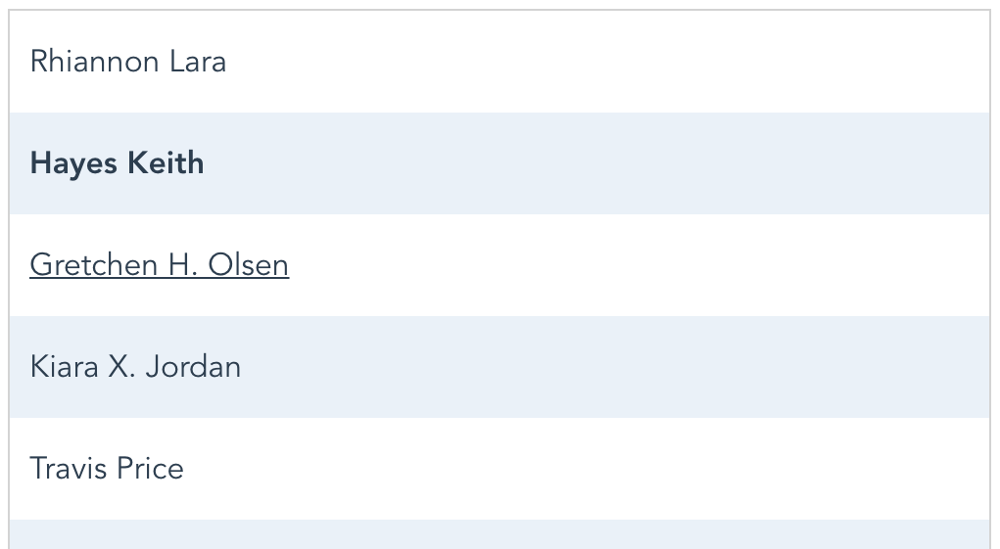

# MarketDial's vue-contacts-app
We love all our co-workers here at MarketDial and want to create an address book to store everyone's contact info so we can keep in touch. We're excited that you're here just in time to help us with that task! Below is an outline of an MVP for our address book but we'd love for you to implement any creative ideas you may have on top of the requirements. Please do not spend more than two hours on the code for this project. Completion is not the goal but instead we'd like to use your code to give us an idea of how you approach and solve a variety of problems across the frontend. When finished with the project, upload it to a repo on your personal GitHub or GitLab account and share the link with us. We will review your code with you during your in-person interview at HQ to hear how you reached your decisions.

## // TODOs
1. Make a form that will create a new contact. Make sure it includes the following fields:
	* Name (required)
	* Email
	* Phone Number
	* Is Favorite
1. Format the list of contacts using Sass.

	
	
	* List Styling
		* List positioning to be in the middle of the page.
		* Border around the list.
	* Item Styling
		* Every odd contact should have a background color of `#eaf1f8`.
		* Remove default list styles and add padding.
		* Text underline on hover.
		* Bold favorited contacts.
1. Make a contact details component that will show the contact's email and phone number when clicking on a contact's name.
1. Verify your app runs without any linting errors.

## Extras
* Add input validation.
* Style the form and contact details using Sass.
* Paginate the contact list.
* Add the ability to sort contacts.
* Add the ability to search contacts.
* Create unit tests.

## API Notes
#### Get All Contacts
`GET http://contacts-api.marketdial.com/contacts`

#### Create a contact
**Request:**
```
POST http://contacts-api.marketdial.com/contact
content-type: application/json

{
    "name": "Billy Bob",
    "phone": "801-555-3213",
    "email": "billy.bob@bob.com",
		"is_favorite": true
}
```

**Response:**
```
{
  "email": "billy.bob@bob.com",
  "id": 106,
  "name": "Billy Bob",
  "phone": "801-555-3213",
	"is_favorite": true
}
```

## Project setup
```
yarn install
```

#### Compiles and hot-reloads for development
```
yarn run serve
```

#### Lints and fixes files
```
yarn run lint
```

#### Run your unit tests (optional)
```
yarn run test:unit
```

#### Compiles and minifies for production (optional)
```
yarn run build
```
